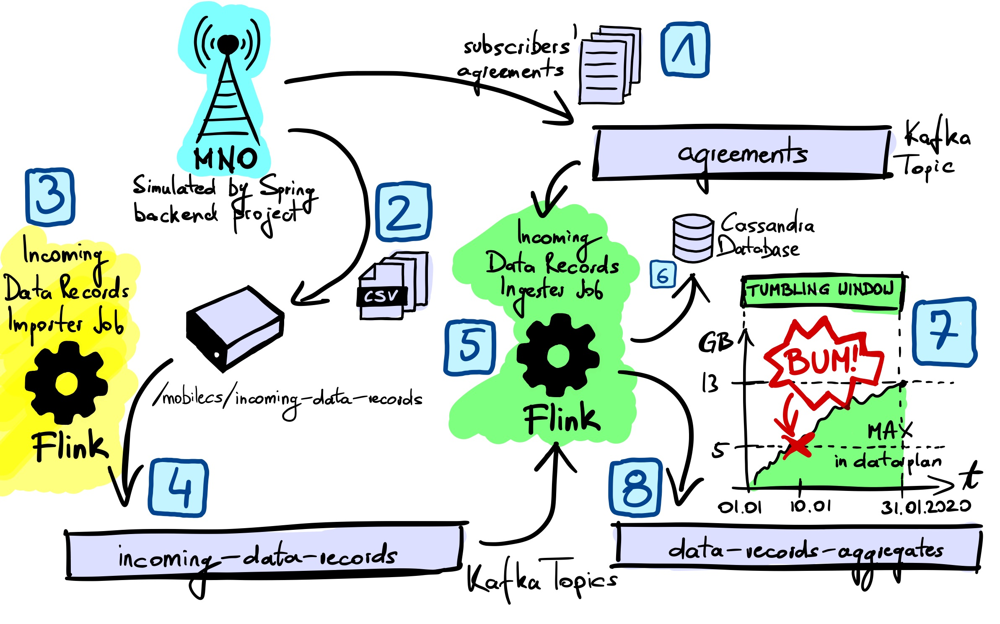

# Project Description

This Case Study draws from the mobile network operators (MNO) domain. The goal of the project is to implement ongoing, live tracking of data usage by mobile subscribers. As soon as data used within a billing period exceeds max data usage defined in the data plan - the system should generate appropriate notification. In this case study, we expect that appropriate messages are published to *data-records-aggregates* Kafka topic. Later these messages could be used for different purposes, like to inform the subscriber they exceeded the data plan or to lower the data speed for the data used outside of the plan. 

The source data for the project are data record files (tracking data used by mobile phone users) and subscribers' agreements defined by MNO. 

# Architecture

The project uses Flink to import the files into the system, and as a streaming platform for detecting the moment of exceeding the data plan. 

An auxiliary Spring backend project helps in generating test data:
- :one: subscribers' agreements that define max data in the data plan, and 
- :two: data record files, that would be coming from MNO in a real project.

The project uses Kafka as the messaging platform and Cassandra database to store ingested data records. Spring backend publishes generated agreements to *agreements* Kafka topic, and stores generated data record files in `/mobilecs/incoming-data-records` folder.

There are two main processes in the Case Study.

## *Importing data records* process

- Implemented by :3: *Incoming Data Records Importer* Flink job
- Reads raw data record files received from MNO (from `/mobilecs/incoming-data-records` folder)
- Enriches them with an identifier that allows to uniquely identify any record globally in the system (regardless of identification provided by MNO)
- Publishes them to :four: *incoming-data-records* Kafka topic

## *Ingesting data records* process 

- Implemented by :five: *Incoming Data Records Ingester* Flink job
- Reads imported data records from the *incoming-data-records* Kafka topic
- Reads subscribers' agreements from the *agreements* Kafka topic
- Matches incoming data records with agreements, creating *ingested* data records, from now on referred to as simply *data records*
- Stores resulting data records in :six: Cassandra database, in *mobilecs.data_record* table
- Defines :seven: tumbling window that corresponds to the billing period
- Aggregates data records within the window and publishes appropriate message to :eight: *data-records-aggregates* topic twice in the window lifetime:
  - as soon as the data used in the period exceeds the data plan (DATA_PLAN_EXCEEDED) 
  - at the end of the billing period (BILLING_PERIOD_CLOSED) 

# Running the project

The project can be executed both in docker-compose and kubernetes. Docker compose allows to quickly start single containers - useful for local development.

## Docker Compose

1. Build maven projects

        mvn clean package
        
1. Start docker compose

        docker-compose up -d --build
    
    :information_source: Due to the nature of docker-compose (no retry policy), projects with dependencies might not start from time to time (e.g. kafka when zookeeper does not start on time, backend when cassandra does not start on time). You may need to start them manually with another call to `docker-compose up`. The solution could be to switch to docker swarm (docker swarm supports retry policy) or use Kubernetes which auto-restarts pods if they fail to start - [see below](#kubernetes).
    
1. Run `docker ps -a`, the output should look like below: 6 containers in *up* status.
    
        CONTAINER ID        IMAGE                             COMMAND                  CREATED              STATUS              PORTS                                                       NAMES
        2d06adc47024        mobilecs-backend                  "/docker-entrypoint.…"   About a minute ago   Up About a minute   0.0.0.0:8080->8080/tcp                                      mobilecs-backend
        59b8931c7760        flink:1.11.2-scala_2.11-java11    "/docker-entrypoint.…"   About a minute ago   Up About a minute   6123/tcp, 8081/tcp                                          mobilecs-taskmanager
        bfca0eeae3b8        confluentinc/cp-kafka:5.4.3       "/etc/confluent/dock…"   About a minute ago   Up About a minute   0.0.0.0:9092->9092/tcp, 0.0.0.0:29092->29092/tcp            mobilecs-kafka
        f3a29089bce0        confluentinc/cp-zookeeper:5.4.3   "/etc/confluent/dock…"   About a minute ago   Up About a minute   2888/tcp, 0.0.0.0:2181->2181/tcp, 3888/tcp                  mobilecs-zookeeper
        311f4b8249d6        cassandra:3.11.8                  "docker-entrypoint.s…"   About a minute ago   Up About a minute   7000-7001/tcp, 7199/tcp, 9160/tcp, 0.0.0.0:9042->9042/tcp   mobilecs-cassandra
        e57f76f6517b        mobilecs-flink                    "/docker-entrypoint-…"   About a minute ago   Up About a minute   6123/tcp, 0.0.0.0:8081->8081/tcp                            mobilecs-jobmanager
        
1. Open Flink Dashboard (http://localhost:8081/#/job/running) and make sure both jobs are running: *Incoming Data Records Importer* and *Incoming Data Records Ingester*

1. In case of restarting the project and running it again from scratch (e.g. after `docker-compose down`) make sure to also clean the volume in which incoming data files are generated (`docker-compose down` does not clean volumes).
    - Run `docker exec -it mobilecs-backend bash`
    - Delete all the files in `/mobilecs/incoming-data-records`
    
    Or delete the volume before restarting docker compose: `docker volume rm mobilecs_incoming-data-records`
    
1. Start Kafka consumer for expected data records aggregated in Flink

        docker exec mobilecs-kafka bash -c "kafka-console-consumer --topic data-records-aggregates --from-beginning --bootstrap-server mobilecs-kafka:29092 --property print.timestamp=true"

1. Generate test agreement and CDR Data Records

        curl http://localhost:8080/api/agreements/generate
        curl http://localhost:8080/api/incoming-data-records/generate

1. Go back to the console in which Kafka consumer is running for *data-records-aggregates* topic. Check results, it should look like below. When it shows - it means that this Case Study project finished successfully.
    
        CreateTime:1580511599999	{
          "agreementId" : "0b12c601-9287-3f5c-a78c-df508fe0f889",
          "year" : 2020,
          "month" : 1,
          "latestRecordedAt" : "Fri Jan 10 23:00:00 UTC 2020",
          "latestInternalRecordId" : "523d8cc7-e611-3508-90bc-fab260b2973e",
          "totalRecordedBytes" : 5697948758,
          "billingPeriodTimeZone" : "Europe/Warsaw",
          "maxBytesInBillingPeriod" : 5368709120,
          "type" : "DATA_PLAN_EXCEEDED"
        }
        CreateTime:1580511599999	{
          "agreementId" : "0b12c601-9287-3f5c-a78c-df508fe0f889",
          "year" : 2020,
          "month" : 1,
          "latestRecordedAt" : "Thu Jan 30 23:00:00 UTC 2020",
          "latestInternalRecordId" : "b58a3008-23a9-384c-b4e6-2cc837d1ef07",
          "totalRecordedBytes" : 13559994361,
          "billingPeriodTimeZone" : "Europe/Warsaw",
          "maxBytesInBillingPeriod" : 5368709120,
          "type" : "BILLING_PERIOD_CLOSED"
        }

1. Other commands for further insight
    - Kafka consumer for agreements generated in backend service
        
            docker exec mobilecs-kafka bash -c "kafka-console-consumer --topic agreements --from-beginning --bootstrap-server mobilecs-kafka:29092 --property print.timestamp=true"
        
    - Kafka consumer for data records imported by Flink
        
            docker exec mobilecs-kafka bash -c "kafka-console-consumer --topic incoming-data-records --from-beginning --bootstrap-server mobilecs-kafka:29092 --property print.timestamp=true"
    
    - Bash for backend service
    
            docker exec -it mobilecs-backend bash
    
1. Useful docker and docker compose commands

        docker volume ls
        docker-compose logs -f --tail=all
        docker-compose up -d kafka
        docker-compose down
        docker system prune -a --volumes
        
    :warning: `docker system prune -a --volumes` cleans up docker **COMPLETELY** so use with caution! More on these cleaning commands, [here](https://devopsheaven.com/docker/volumes/purge/devops/2018/05/25/purge-docker-images-containers-networks-volumes.html). 
        
## Kubernetes

1. Install and start minikube, https://minikube.sigs.k8s.io/docs/start/, e.g.:

        minikube start --driver=hyperkit --cpus=3 --memory=8g

1. Build maven projects and deploy docker images

        ./k8s-build-and-deploy.sh

    :information_source: The script configures docker daemon to use minikube, so that kubernetes can access mobilecs project images (also requires `imagePullPolicy: IfNotPresent` - see [kubernetes.yaml](https://github.com/bkaminnski/mobile-case-study/blob/master/kubernetes.yaml).

1. Apply all kubernetes objects

        kubectl apply -f kubernetes.yaml

1. Run `kubectl get pods`, the output should look like below: 6 pods in *READY* status 1/1.

        NAME                                      READY   STATUS    RESTARTS   AGE    LABELS
        backend-deployment-6bb6846cbd-5rhns       1/1     Running   6          4m8s   app=backend,pod-template-hash=6bb6846cbd
        cassandra-deployment-b6ff764dc-qskt9      1/1     Running   0          4m8s   app=cassandra,pod-template-hash=b6ff764dc
        jobmanager-deployment-5c88484cd8-z2xmz    1/1     Running   0          4m7s   app=jobmanager,pod-template-hash=5c88484cd8
        kafka-deployment-598c8fb974-tckr5         1/1     Running   0          4m7s   app=kafka,pod-template-hash=598c8fb974
        taskmanager-deployment-8479dd5b48-pcn26   1/1     Running   0          4m7s   app=taskmanager,pod-template-hash=8479dd5b48
        zookeeper-deployment-6875df84c7-45qw4     1/1     Running   0          4m8s   app=zookeeper,pod-template-hash=6875df84c7
    
1. Open Flink Dashboard (e.g. http://192.168.64.5:30081/#/job/running) and make sure both jobs are running: *Incoming Data Records Importer* and *Incoming Data Records Ingester*

    :information_source: Run `minikube service jobmanager-rest-service --url` to check URL of Flink Dashboard and replace in the address above.

1. In case of restarting the project and running it again from scratch make sure to also clean the volume in which incoming data files are generated.
    - Run `kubectl exec -it `kubectl get pods -l app=backend -o name` -- bash`
    - Delete all the files in `/mobilecs/incoming-data-records`
   
1. Start Kafka consumer for expected data records aggregated in Flink

        kubectl exec `kubectl get pods -l app=kafka -o name` -- bash -c "kafka-console-consumer --topic data-records-aggregates --from-beginning --bootstrap-server kafka-service:29092 --property print.timestamp=true"

1. Generate test CDR Data Records and agreements

        curl `minikube service backend-service --url`/api/agreements/generate
        curl `minikube service backend-service --url`/api/incoming-data-records/generate

1. Go back to the console in which Kafka consumer is running for *data-records-aggregates* topic. Check results, it should look like below. When it shows - it means that this Case Study project finished successfully.

        CreateTime:1580511599999	{
          "agreementId" : "0b12c601-9287-3f5c-a78c-df508fe0f889",
          "year" : 2020,
          "month" : 1,
          "latestRecordedAt" : "Fri Jan 10 23:00:00 UTC 2020",
          "latestInternalRecordId" : "523d8cc7-e611-3508-90bc-fab260b2973e",
          "totalRecordedBytes" : 5697948758,
          "billingPeriodTimeZone" : "Europe/Warsaw",
          "maxBytesInBillingPeriod" : 5368709120,
          "type" : "DATA_PLAN_EXCEEDED"
        }
        CreateTime:1580511599999	{
          "agreementId" : "0b12c601-9287-3f5c-a78c-df508fe0f889",
          "year" : 2020,
          "month" : 1,
          "latestRecordedAt" : "Thu Jan 30 23:00:00 UTC 2020",
          "latestInternalRecordId" : "b58a3008-23a9-384c-b4e6-2cc837d1ef07",
          "totalRecordedBytes" : 13559994361,
          "billingPeriodTimeZone" : "Europe/Warsaw",
          "maxBytesInBillingPeriod" : 5368709120,
          "type" : "BILLING_PERIOD_CLOSED"
        }

1. Other commands for further insight
    - Kafka consumer for agreements generated in backend service
        
            kubectl exec `kubectl get pods -l app=kafka -o name` -- bash -c "kafka-console-consumer --topic agreements --from-beginning --bootstrap-server kafka-service:29092 --property print.timestamp=true"
        
    - Kafka consumer for data records imported in Flink
        
            kubectl exec `kubectl get pods -l app=kafka -o name` -- bash -c "kafka-console-consumer --topic incoming-data-records --from-beginning --bootstrap-server kafka-service:29092 --property print.timestamp=true"
    
    - Open bash for backend service
    
            kubectl exec -it `kubectl get pods -l app=backend -o name` -- bash
        
1. Useful kubernetes commands (read about stern [here](https://github.com/burrsutter/9stepsawesome/blob/3ddeead8b5cd5841760f2a4beb90eeae35a8a4b1/3_logs.adoc))

        minikube dashboard
        kubectl get pods --show-labels -w -o wide
        watch -n 0.1 kubectl get pods --show-labels -o wide
        stern backend

